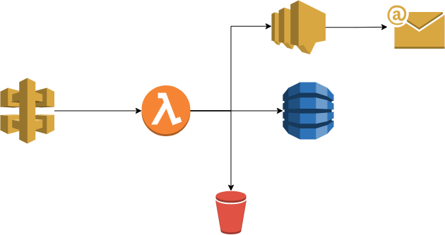

# AWS - CDK Stack
## 1. Introduction
### 1.1	Overview

The following CDK stack will deploy the following resources.
- API Gateway
- Lambda
- DynamoDB
- SNS topic and SMS subscription
- S3 bucket

## 2 Logical Architecture
### 2.1	Logical System Component Overview

1. Invoke GET rest api via APIGW.
2. Lambda will perform business logic.
3. Lambda will
    - Write to DynamoDB.
    - Write to S3.
    - Send msg to SNS and SNS will send SMS to mobile for alert.

