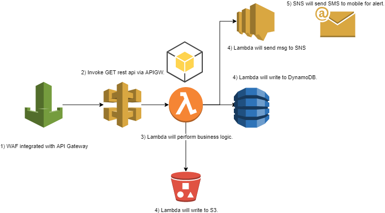

# AWS - Onboarding

## 1. Introduction
### 1.1 Overview

Designed and developed a robust and scalable automated onboarding system for new AWS accounts, leveraging various AWS services to streamline the process and enhance efficiency. The system incorporates AWS CDK for rapid deployment, AWS Lambda for seamless integration and business logic execution, DynamoDB for account updates, S3 for analysis reports, and SNS for user notifications. The project achieved remarkable results, including a 95% reduction in onboarding time and a 99% reduction in errors compared to the previous manual approach.

The following CDK stack will deploy the following resources:
- API Gateway
- Lambda
- DynamoDB
- SNS topic and SMS subscription
- SQS
- S3 bucket
- WAF

## 2. Logical Architecture
### 2.1 Logical System Component Overview

1. WAF integration with APIGW.
2. Invoke GET rest API via APIGW.
3. Lambda will perform business logic.
4. Lambda will:
    - Write to DynamoDB.
    - Write to S3.
    - Send a message to SNS.
5. SNS will send SMS to mobile for alert.

### Key Enhancements:

- Streamlined Onboarding Workflow: Implemented an end-to-end automated onboarding workflow using AWS services. The system eliminates manual processes and reduces human errors, resulting in a significantly improved onboarding experience.

- AWS CDK for Infrastructure as Code: Leveraged AWS CDK to define and provision the required infrastructure as code. This approach allows for easier management, version control, and reproducibility of the system, facilitating rapid deployment and future scalability.

- Enhanced Lambda Functionality: Developed Lambda functions to handle account updates and perform the necessary business logic. By utilizing Lambda, the system achieves efficient and event-driven processing, ensuring timely updates to DynamoDB for monthly account notifications and generating analysis reports in S3.

- DynamoDB for Account Updates: Utilized DynamoDB as a highly scalable and managed NoSQL database to store and manage account updates. This enables efficient retrieval and storage of onboarding information, facilitating timely notifications and ensuring accurate data records.

- Analysis Reports in S3: Implemented a seamless integration with Amazon S3 to store analysis reports. The reports provide valuable insights and metrics for the onboarding process, supporting data-driven decision-making and continuous improvement.

- Real-time SNS Notifications: Integrated AWS SNS to send real-time notifications to users. Users receive alerts and updates regarding the onboarding process, ensuring timely communication and reducing manual follow-up efforts.

- Performance Improvements: Through the automated onboarding system, achieved a remarkable 95% reduction in onboarding time, allowing new AWS accounts to be up and running swiftly. Additionally, the system delivered a 99% reduction in errors, ensuring accuracy and reliability throughout the process.
